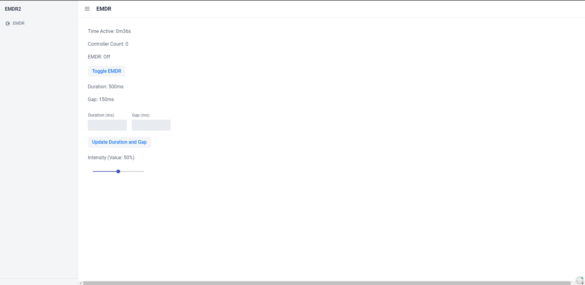

# EMDR
*A program that provides bilateral stimulation through game controllers, managed by a Vaadin web interface.*

*EMDR's user interface, allowing control over nearly all aspects of the execution. Created through the Vaadin framework.*

### Purpose
***NOTE: While intended to simulate a powerful therapeutic experience, untrained individual usage of this project is STRONGLY DISCOURAGED.***

This program allows the induction of bilateral stimulation through the rumble feature of game controllers. I procured this idea after attending a session of EMDR therapy and noting the glaring similarities between the rumble feature of controllers and the pulsers the therapist used. Lacking a in-depth knowledge of using sdl2gdx, I thought LibGDX was necessary for usage (despite the repository's documentation) and built the program in that, using variables in the Application source file and text displays from LibGDX to display information. However, the variant of the prototype with text displays was prone to crashes and memory leaks due to my scrapwork approach to building it. I opted to take another shot at it, cutting unecessary overhead (LibGDX) and using a web api for control I had been looking at for a while: Vaadin.

### Frameworks/Execution
EMDR uses a non-LibGDX implementation of [electronstudio/sdl2gdx](https://github.com/electronstudio/sdl2gdx) and [Vaadin](https://github.com/vaadin) 21 Flow as the base frameworks for its operation. The base project files to be put into Eclipse were generated through [Vaadin Start](https://start.vaadin.com/app/). Because Vaadin does not display the page until the view's constructor is fully executed, I utilized TimerTasks and listeners to implement the elements of the page that needed to run asynchronously, such as timing/intensity adjustments, controller count, EMDR toggling, active time counting, etc.

### Deployment
When using this repository as a project, be aware that it was built with the project name `emdr2`. This is relevant for pom.xml, run configurations, and other values. The other step is to adjust the port to your needs. This value can be configured in `resources/application.properties`. From here, running the `clean package` goal will provide a .jar file which can be ran to host the website and run all associated background tasks. Although the presence of a webpage allows the EMDR to be controlled from other devices (like mobile devices), remember that the jar needs to be run on the machine with the controllers attatched.
